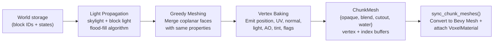
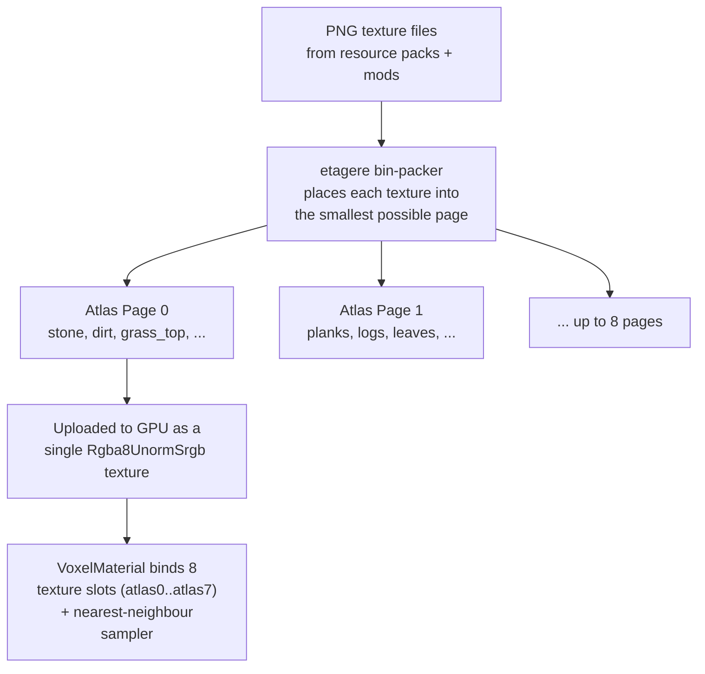
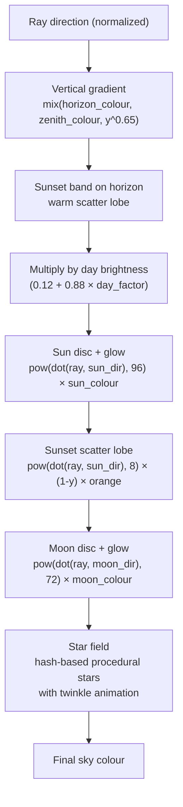
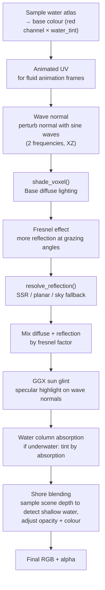
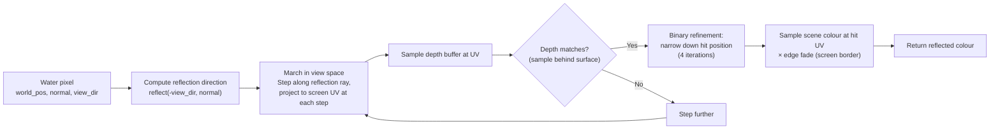
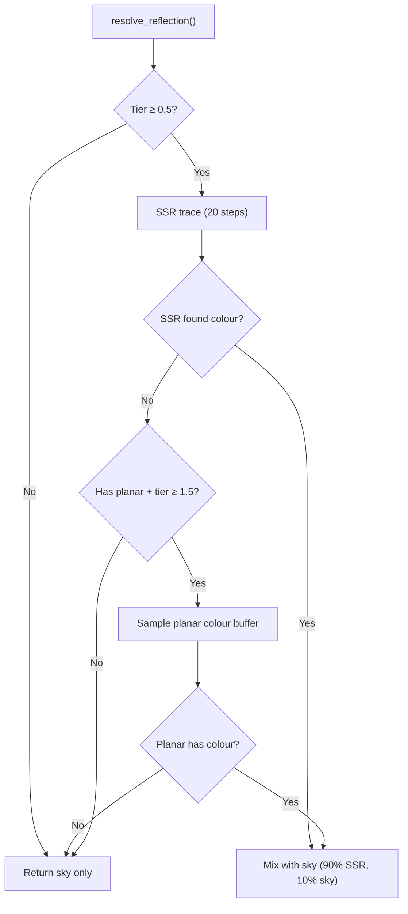
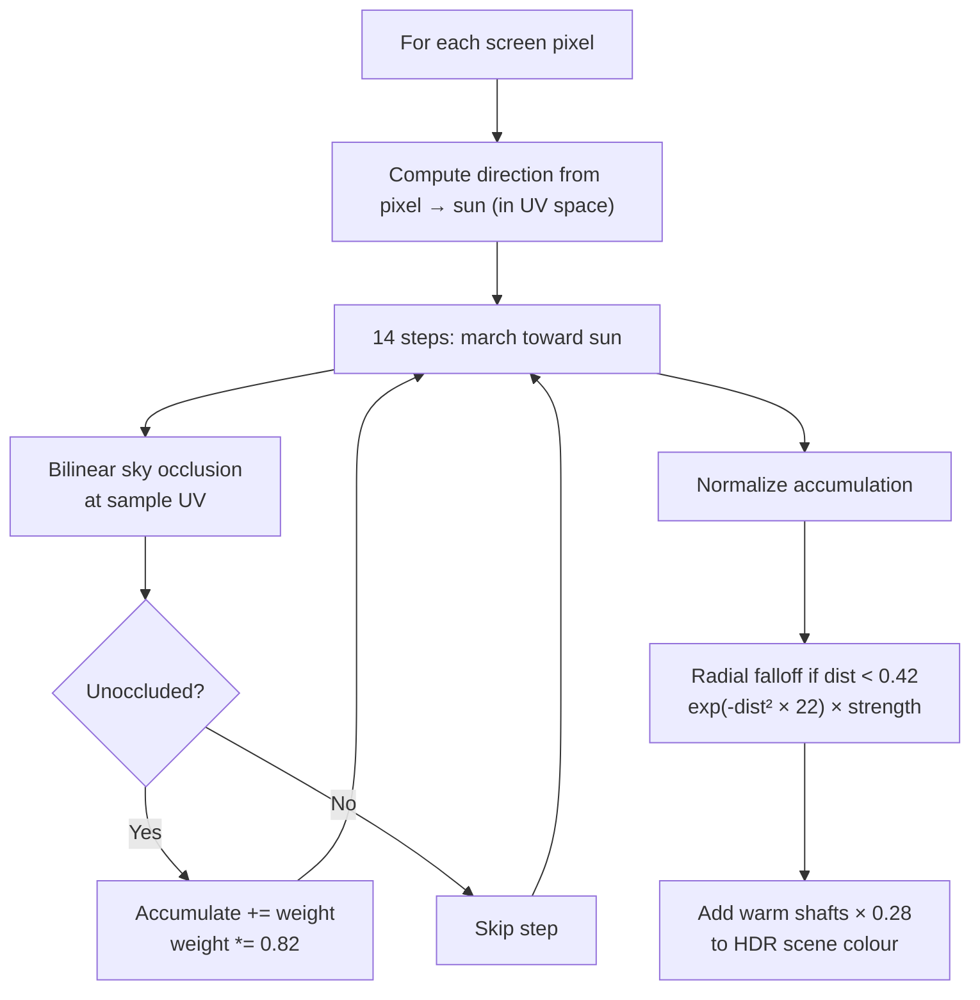

# Stagcrest Rendering Architecture

Authoritative reference for the custom Bevy/WGSL renderer in `stagcrest-render`.
Explains every visual effect, lighting system, and rendering strategy — from
individual triangles on screen up to time-of-day sky and water reflections.

Assumes you can program but may not know rendering jargon; each term is defined
when first introduced.

> **Agents:** do not load this whole file by default. Use the topic index in
> [`AGENTS.md`](../../../AGENTS.md) at the repo root and open only the sections
> you need.

---

## Table of Contents

1. [The Graphics Stack](#1-the-graphics-stack)
2. [The Frame: What Happens Each Frame](#2-the-frame-what-happens-each-frame)
3. [Mesh Baking: How Blocks Become Triangles](#3-mesh-baking-how-blocks-becomes-triangles)
4. [Texture Atlas: One Big Sheet of Textures](#4-texture-atlas-one-big-sheet-of-textures)
5. [Voxel Lighting Model](#5-voxel-lighting-model)
6. [Skybox: The Procedural Sky](#6-skybox-the-procedural-sky)
7. [Water Rendering](#7-water-rendering)
8. [Reflections (Tiered)](#8-reflections-tiered)
9. [Volumetric Light Shafts (God Rays)](#9-volumetric-light-shafts-god-rays)
10. [Underwater Post-Process](#10-underwater-post-process)
11. [Block Outline](#11-block-outline)
12. [Entity Rendering](#12-entity-rendering)
13. [Bevy Built-in Effects](#13-bevy-built-in-effects)
14. [Graphics Settings & Quality Tiers](#14-graphics-settings--quality-tiers)
15. [Code Map](#15-code-map)
16. [Appendix: Key GPU Uniforms](#appendix-key-gpu-uniforms)

### Quick reference

| Topic                              | Section                                          |
| ---------------------------------- | ------------------------------------------------ |
| World axes, sun vs light direction | [§5.5](#55-world-axes--lighting-conventions)     |
| Per-frame GPU pass order           | [§2](#2-the-frame-what-happens-each-frame)       |
| Baked light + shadow maps          | [§5](#5-voxel-lighting-model)                    |
| Chunk meshing & vertex layout      | [§3](#3-mesh-baking-how-blocks-become-triangles) |
| Texture atlas packing              | [§4](#4-texture-atlas-one-big-sheet-of-textures) |
| Sky palette & time of day          | [§6.3](#63-time-of-day-palette)                  |
| Water shader pipeline              | [§7](#7-water-rendering)                         |
| Reflection tiers (SSR / planar)    | [§8](#8-reflections-tiered)                      |
| God rays                           | [§9](#9-volumetric-light-shafts-god-rays)        |
| Quality presets & toggles          | [§14](#14-graphics-settings--quality-tiers)      |
| Source file index                  | [§15](#15-code-map)                              |
| GPU uniform layouts                | [Appendix](#appendix-key-gpu-uniforms)           |

---

## 1. The Graphics Stack

Stagcrest renders using **Bevy 0.19** (a Rust game engine), which internally uses
**wgpu** (a safe GPU abstraction). Depending on your operating system, wgpu speaks
Vulkan (Linux/Windows), Metal (macOS), or DirectX 12 (Windows).

All custom visual effects are written in **WGSL** (WebGPU Shading Language), the
standard shader language for the WebGPU API. WGSL programs run _on the GPU_ —
typically thousands of times in parallel for every pixel on screen.

```
┌────────────────────────────────────────────────┐
│              Stagcrest Client                  │
│  ┌────────────────────────────────────────┐    │
│  │          Bevy ECS (App)                │    │
│  │  CPU side: systems, resources, queries │    │
│  └──────────────┬─────────────────────────┘    │
│                 │ Extract (sync data to render)│
│  ┌──────────────▼─────────────────────────┐    │
│  │        Bevy Render World               │    │
│  │  GPU side: pipelines, bind groups,     │    │
│  │  render passes                         │    │
│  └──────────────┬─────────────────────────┘    │
│                 │ wgpu                         │
│  ┌──────────────▼─────────────────────────┐    │
│  │     Vulkan / Metal / DirectX 12        │    │
│  └────────────────────────────────────────┘    │
└────────────────────────────────────────────────┘
```

### Terminology (quick primer)

| Term                    | What it means                                                                                                                           |
| ----------------------- | --------------------------------------------------------------------------------------------------------------------------------------- |
| **Vertex**              | A point in 3D space. Collections of 3 vertices form triangles.                                                                          |
| **Mesh**                | A collection of vertices and triangles that describes a shape.                                                                          |
| **Shader**              | A small program that runs on the GPU. Vertex shaders process vertices; fragment (pixel) shaders decide the final colour of each pixel.  |
| **Texture**             | A 2D image (like a photograph) wrapped onto a 3D surface.                                                                               |
| **Atlas**               | One big texture that packs many smaller textures side-by-side (like a sprite sheet).                                                    |
| **Normal**              | A direction vector perpendicular to a surface. Used by lighting to figure out how light bounces off a surface.                          |
| **UV**                  | 2D coordinates (0–1) that map a point on a 3D mesh to a specific pixel in a texture.                                                    |
| **Render Pass**         | A single step in rendering that draws to a texture or the screen. A frame has many passes.                                              |
| **Fullscreen Triangle** | A single triangle that covers the entire screen. Used for post-processing effects (bloom, underwater, etc.).                            |
| **HDR**                 | High Dynamic Range — colour values brighter than 1.0 are allowed, so the sun can be blindingly bright before tonemapping compresses it. |
| **Tonemapping**         | The step that squeezes HDR colours (0..∞) into the SDR range (0..1) your monitor can display.                                           |

---

## 2. The Frame: What Happens Each Frame

Every frame (16.6 ms at 60 FPS, 8.3 ms at 120 FPS), the GPU executes a sequence of
render passes in a specific order. Here is the full pipeline:

```mermaid
flowchart TD
    A["1. Depth / Normal / Motion-Vector Prepass<br/>Draws every opaque+cutout object<br/>Produces depth, normal, velocity textures"]:::prepass
    B["2. Main Opaque Pass<br/>Draws all opaque voxel chunks<br/>Uses the voxel shader (VoxelMaterial)"]:::opaque
    C["3. Procedural Skybox<br/>Fullscreen triangle, runs skybox.wgsl<br/>Writes sky colour to HDR colour buffer"]:::sky
    D["4. Scene Color & Depth Copy<br/>Copies the HDR colour + depth textures<br/>into separate buffers for SSR/reflections"]:::copy
    E["5. Main Transparent Pass<br/>Draws water surfaces, transparent blocks,<br/>cutout blocks (leaves, glass)"]:::transparent
    F["6. Volumetric Light Shafts<br/>Fullscreen pass, ray-marches depth<br/>toward sun position, adds god rays"]:::post
    G["7. Tonemapping (TonyMcMapface)<br/>Compresses HDR → SDR"]:::post
    H["8. Underwater Tint<br/>Fullscreen pass, applies tint + darkening"]:::post
    I["9. Post-Processing Stack<br/>SSAO / Bloom / TAA / DOF / Sharpen<br/>(tier-gated, some or all may be skipped)"]:::post
    J["10. Upscaling<br/>Resolves MSAA (if any) and scales to window"]:::post
    K["11. UI Overlay<br/>Separate Camera2d composited with alpha blend"]:::ui

    A --> B
    B --> C
    C --> D
    D --> E
    E --> F
    F --> G
    G --> H
    H --> I
    I --> J
    J --> K

    classDef prepass fill:#e1d5e7,stroke:#9673a6
    classDef opaque fill:#d5e8d4,stroke:#82b366
    classDef sky fill:#dae8fc,stroke:#6c8ebf
    classDef copy fill:#ffe6cc,stroke:#d79b00
    classDef transparent fill:#d5e8d4,stroke:#82b366
    classDef post fill:#f8cecc,stroke:#b85450
    classDef ui fill:#fff2cc,stroke:#d6b656
```



### Why this order?

- The **prepass** runs first so every later pass can read per-pixel depth, normal,
  or motion vectors.
- The **opaque pass** writes all solid geometry. The **skybox** goes _after_ opaque
  but _before_ transparent and reflections, so the sky is visible through holes in
  water/glass. (Traditional engines draw the sky first; this engine does it the
  other way for reflection-copy reasons.)
- **Scene copy** happens right after the sky so the reflection system captures
  opaque terrain + sky (but not water, which is drawn later).
- The **transparent pass** draws water and glass on top.
- **Volumetric light** needs the final opaque+transparent scene + depth to compute
  god rays, but runs before tonemapping because it works in HDR.
- **Underwater** goes after tonemapping because it works on the final SDR-ish image
  and murks it up.

---

## 3. Mesh Baking: How Blocks Become Triangles

Minecraft-style blocks are _voxels_ (3D pixels). Each chunk (16×16×16 blocks) must
be converted into GPU-friendly triangle meshes before it can be drawn. This happens
entirely on the CPU.

### 3.1. Chunk Meshing

For each chunk, the mesher (`crates/stagcrest-mesh/`) examines every block position
and decides which faces are visible (a face is visible if the neighbouring block
is air or a fluid). Visible faces are emitted as triangles.



### 3.2. Greedy Meshing

The greedy meshing algorithm (`crates/stagcrest-mesh/src/greedy_mesh.rs`) merges
adjacent coplanar faces that share the same texture, tint, and light level into
**one big rectangle** instead of many tiny ones. This dramatically reduces triangle
count — a flat desert floor becomes a handful of quads instead of 16×16 individual
quads.

### 3.3. Four Render Buckets

Every chunk is split into four separate meshes (called "buckets"), each drawn in a
different pass:

| Bucket | Name   | Contains                          | Alpha mode                     |
| ------ | ------ | --------------------------------- | ------------------------------ |
| 0      | Opaque | Stone, dirt, planks (most blocks) | Fully solid                    |
| 1      | Blend  | Glass, water (non-surface), ice   | Transparency (blend)           |
| 2      | Cutout | Leaves, iron bars, fences         | Alpha-test (discard below 0.5) |
| 3      | Water  | Water surfaces only               | Special water material         |

Each bucket gets its own Bevy `Mesh` + `MeshMaterial3d` entity, which lets Bevy
sort and batch draw calls efficiently.

### 3.4. Vertex Data

Each vertex carries a lot of extra data beyond just position and UV:

| Attribute           | Size    | What it stores                                                                                                        |
| ------------------- | ------- | --------------------------------------------------------------------------------------------------------------------- |
| Position            | 3 × f32 | X, Y, Z in world space                                                                                                |
| UV                  | 2 × f32 | Texture coordinates within the atlas                                                                                  |
| Overlay UV          | 2 × f32 | A second set of UVs for overlay textures (e.g. snow on grass)                                                         |
| Block Tint          | 1 × f32 | What kind of tint to apply: 0 = none, 0.5–1.5 = grass tint, 1.5–2.5 = foliage tint, 2.875–4.125 = redstone power tint |
| Overlay Tint        | 1 × f32 | Tint for the overlay layer                                                                                            |
| Tint Mul            | 3 × f32 | Per-vertex RGB tint multiplier (for biome-coloured grass)                                                             |
| Atlas Index         | 1 × f32 | Which of the 8 atlas pages this texture is on                                                                         |
| Overlay Atlas Index | 1 × f32 | Atlas page for the overlay                                                                                            |
| Normal              | 1 × u8  | Encoded face direction (6 axis directions packed into 3 bits)                                                         |
| Light               | 1 × u8  | Packed: 4 bits skylight + 4 bits block light                                                                          |
| AO                  | 1 × u8  | Ambient occlusion (0–3)                                                                                               |
| Flags               | 1 × u8  | Bitfield: emissive, faces_fluid, etc.                                                                                 |

---

## 4. Texture Atlas: One Big Sheet of Textures

Instead of binding hundreds of individual block textures to the GPU every frame,
all block textures are **packed into up to 8 large atlas pages** (each up to
2048×2048 pixels or similar). The atlas is built at load time using a bin-packing
algorithm (`etagere` crate).

### How the atlas works



UV coordinates in the mesh data refer to positions _within_ the atlas, not within
individual texture files. The atlas system also supports **animated textures**
(fluids): the atlas packs all animation frames vertically, and the shader selects
a frame based on elapsed time.

### 4.1. Atlas revisions

When the atlas changes (e.g. a resource pack is reloaded), a global `revision`
counter increments. Any cached mesh that was built against the old atlas is
invalidated and rebuilt.

---

## 5. Voxel Lighting Model

The lighting system is **hybrid**: it combines pre-baked per-vertex light stored in
the mesh data with real-time directional shadow maps.

### 5.1. The Two Light Types

**Skylight** comes from the sun/moon and fills every block that can see the sky.
It is computed by a vertical flood-fill: at the top of the chunk, every column is
set to 15 (max); each solid block the light passes through reduces it by the
block's attenuation value. Underground it reaches 0.

**Block light** (torch light) is emitted by light-emitting blocks (torches,
glowstone, lava). It propagates spherically using a BFS flood-fill: each step
reduces by 1 plus attenuation, down to 0.

Both values are stored in a `ChunkLightGrid` per chunk (a 3D array of u8 values,
with a 1-block border for neighbour access).

### 5.2. Per-Vertex Lighting

During mesh building, each vertex samples the light grid at the air-side corner
of its face (the "vertex shade" function in `light.rs`). It also computes
**ambient occlusion** by checking how many of the 3 neighbouring corners are
occupied by solid blocks (0–3, mapped to 0.5–1.0 brightness).

The vertex stores:

- **Sky light** (4 bits, 0–15)
- **Block light** (4 bits, 0–15)
- **AO** (2 bits, 0–3)
- **Emissive flag** (1 bit)

### 5.3. The `shade_voxel()` Function (GPU)

In the shader, `shade_voxel()` (in `scene_lighting.wgsl`) combines all light
sources:

```
final = albedo × (baked_ambient + torch + direct_sun + direct_moon) × AO × tint
```

Where:

- **`baked_ambient`** = skylight level × artist-defined ambient colour curve
  (this is the "ambient occlusion" of skylight — it does not move with the sun)
- **`torch`** = block light level × quadratic boost (0.85 + level × 0.35)
- **`direct_sun`** = N·L (normal dot light direction) × sun_shadow × sun_colour
  × day_factor — this is the only part that moves with the sun; it is multiplied
  by the shadow map lookup
- **`direct_moon`** = same as sun but for moonlight, reduced by 0.4×, active at
  night
- **`AO`** = the baked ambient occlusion value (0.5–1.0)
- **`tint`** = a final colour multiplier that shifts toward warm sunset tones near
  dusk

**Emissive** blocks bypass all lighting and return `albedo × (1.3 + block_level × 0.9)`.

### 5.4. Shadow Maps (Real-Time)

The sun and moon each have a dedicated Bevy `DirectionalLight` (`SunLight` /
`MoonLight` markers on the client). Both use `num_cascades` (2–4) and
`maximum_distance` (64–160 blocks) from graphics settings.

Shadow **strength** is continuous 0..1 per body, computed in
[`celestial_light.rs`](../../../stagcrest-client/src/celestial_light.rs) from disc
factors and `day_factor`:

- **Medium+:** both bodies contribute shadow strength during twilight when their disc is visible
- **Low:** one CSM at a time — sun and moon strengths are multiplied by a smooth
  dominance crossfade (`smoothstep` on `day_factor` between 0.15 and 0.35), not a hard switch

Bevy `shadow_maps_enabled` is binary (GPU requirement) and turns on when strength
exceeds a small epsilon (0.02). The shader fades shadow contribution with
`mix(1.0, shadow_sample, strength)` so visuals stay smooth even when the map toggles.

Bevy assigns GPU light indices by sorting `(volumetric, shadow_maps_enabled, entity)`.
The client replicates that sort each frame and passes indices in
`SceneLightingUniform.shadow_params` (`.x`/`.y` = index, `.z`/`.w` = shadow strength 0..1).
WGSL calls `fetch_celestial_shadows()` which reads the correct map per body.

Directional light **illuminance** scales with disc factor independently of shadow
enable, so Bevy-lit geometry fades smoothly at the horizon.

In the shader, shadow lookup returns 0.0–1.0 (1.0 = fully lit), multiplied into
`direct_sun` / `direct_moon`:

- A block in shadow still gets baked skylight + torch light
- Sun and moon shadows use their own incoming light directions at dawn/dusk

**Camera-dependent coverage (expected, not a bug):** Bevy fits each cascade to the
**camera frustum**, not the world. As you move or rotate the view, the shadow maps
re-center on what the camera sees, so static geometry can appear to gain or lose
shadows at cascade boundaries or when it enters/leaves the configured
`shadow_distance`. Shadow texels are not world-stabilized by default, so edges may
"swim" slightly when the camera moves. Tune `shadow_cascades`, `shadow_distance`, and
Bevy's `CascadeShadowConfigBuilder` overlap/stabilization fields if this becomes
distracting.

### 5.5. World Axes & Lighting Conventions

**World coordinate system** (`stagcrest-protocol`):

- **+Y** is up.
- **+X** is east; **+Z** is south at noon.
- The sun rises in the east and sets in the west.

**Two direction vectors** for the sun (and the same position convention for the
moon):

| Concept            | Vector      | Used by                                                                 |
| ------------------ | ----------- | ----------------------------------------------------------------------- |
| `sun_position_dir` | Scene → sun | WGSL `SceneLighting`, skybox, water glint, reflections, volumetric rays |
| `sun_light_dir`    | Sun → scene | Sun `DirectionalLight` orientation and sun CSM                          |
| `moon_position_dir`| Scene → moon| WGSL moon N·L and sky moon disc                                         |
| `moon_light_dir`   | Moon → scene| Moon `DirectionalLight` orientation and moon CSM                        |

`sun_position_dir` points toward where the disc appears in the sky.
`sun_light_dir` is the incoming light direction (roughly the negative of
`sun_position_dir`). `moon_dir()` blends smoothly between day, twilight-horizon, and
night-high targets using `smoothstep` bands on sun elevation (no piecewise jumps at
`y = ±0.12`). Disc factors (`sun_disc_factor`, `moon_disc_factor`) use the same
smooth ramps. CPU sources: [`world_time.rs`](../../../stagcrest-protocol/src/world_time.rs)
for directions, [`sky_palette.rs`](../src/sky_palette.rs) for colours.

---

## 6. Skybox: The Procedural Sky

The skybox (`skybox.wgsl`) is a **fullscreen triangle** — a single triangle that
covers the entire screen. No cube map or 3D mesh is needed.

### 6.1. How it works

1. The vertex shader generates a triangle that covers the NDC (-1 to +1) square.
2. For each pixel, the fragment shader computes a **ray direction** by un-projecting
   the pixel position through the camera's view-projection matrix (inverting `clip →
world`).
3. That ray direction is passed to `sample_sky_direction()`, which computes the
   sky colour procedurally.

### 6.2. `sample_sky_direction()` (scene_lighting.wgsl)

This function computes the colour of the sky in any direction. It blends several
layers:



### 6.3. Time-of-Day Palette

The `SkyPalette` struct (CPU-side, `sky_palette.rs`) computes 8 colour curves per
frame:

| Value             | Blends between                                                      |
| ----------------- | ------------------------------------------------------------------- |
| `sun_colour`      | Morning (warm) → Noon (white) → Sunset (deep orange) → Night (blue) |
| `moon_colour`     | Dim blue at day, bright at night                                    |
| `ambient_colour`  | Soft daytime blue, very dark blue at night                          |
| `horizon_colour`  | Sky colour near the horizon                                         |
| `zenith_colour`   | Sky colour directly overhead                                        |
| `fog_colour`      | Derived from horizon + ambient                                      |
| `sunset_strength` | Peaks when sun is near horizon (twilight band)                      |
| `star_strength`   | 0 at noon, 1 at midnight                                            |

These are blended with biome-specific sky and fog tints. The palette uses 4
keyframes: dawn, noon, dusk, night, with smooth Hermite-style interpolation.

### 6.4. Star Field

The star field is fully procedural — no texture. It uses a hash function on the
ray direction multiplied by a large constant (120) to create pseudo-random star
positions. Stars twinkle via a sine wave on elapsed time. Stars fade out near the
horizon and during the day.

---

## 7. Water Rendering

Water is the most complex single material in the engine. It is rendered as a
transparent surface using `WaterMaterial`.

### 7.1. What the Water Shader Does

The water fragment shader (`water.wgsl`) does, in order:



### 7.2. Key Techniques

**Wave normals:** The surface normal is perturbed by two sine waves at different
frequencies and directions. This creates the illusion of moving water ripples
without needing a normal map texture.

**Fresnel:** At shallow viewing angles (grazing the water surface), reflections
are stronger. The shader uses `pow(1 - dot(N, V), 3)` for this.

**GGX Sun Glint:** A physically-based specular highlight (microfacet BRDF) creates
the bright sparkle on water when looking toward the sun.

**Shore Blending:** The shader samples the scene depth texture to find the
water-to-land transition. At the shore, water becomes more transparent and lighter
(colour shifted slightly warmer).

**Animated UVs:** If the atlas has multiple animation frames packed vertically,
the shader selects a frame based on time.

---

## 8. Reflections (Tiered)

Reflections are controlled by the `reflection_tier` graphics setting. There are
three levels:

| Tier        | Index | What it does                                            |
| ----------- | ----- | ------------------------------------------------------- |
| **SkyOnly** | 0.0   | Only procedural sky reflection (cheap)                  |
| **SSR**     | 1.0   | Screen-space ray marching against the HDR colour buffer |
| **Planar**  | 2.0   | SSR + an off-screen planar reflection camera            |

### 8.1. Screen-Space Reflections (SSR)

SSR works by ray-marching from each water pixel in the direction of the reflected
view ray, checking the depth buffer at each step.



SSR is limited to what is already on screen — it cannot reflect things behind the
camera or occluded by other geometry.

### 8.2. Planar Reflections

When enabled, an **off-screen camera** mirrors the main camera's position and
rotation across the water plane. This camera renders the world (excluding water)
to a separate HDR texture at half resolution.

The reflection camera correctly handles culling inversion (mirrored geometry) and
excludes the `WATER_LAYER` render layer to avoid infinite recursion of water
reflecting water.

Planar reflections capture everything SSR cannot: objects behind the camera,
things occluded in the main view, etc.

### 8.3. Reflection Resolution

The `resolve_reflection()` function (`reflection.wgsl`) ties the tiers together:



---

## 9. Volumetric Light Shafts (God Rays)

The volumetric light effect (`volumetric_light.wgsl`) creates visible light beams
streaming from the sun, particularly when partially occluded by terrain or leaves.

### 9.1. How it works

This is a screen-space effect (no volumetric geometry). For each pixel:

1. Compute the screen-space position of the sun (project sun world position to UV).
2. Ray-march from the pixel toward the sun position in **14 steps**.
3. At each step, sample depth with **bilinear sky-occlusion filtering** (smooth
   0..1 gradients instead of hard depth thresholds — keeps TAA-jittered depth
   stable and avoids frame-to-frame flashing).
4. Accumulate unoccluded steps with exponential decay (weight × 0.82 per step).
5. Skip pixels farther than 0.42 UV from the sun (tight hotspot).
6. Apply radial falloff `exp(-distance² × 22)` × strength, then add warm shafts
   `(1.0, 0.86, 0.55) × 0.28` to the HDR scene colour.

The pass runs in HDR **before** tonemapping and **before** bloom
(`volumetric_light.rs`).



### 9.2. Strength Control

The volumetric light strength varies with the sun's elevation. It peaks at sunrise
and sunset (when the sun is near the horizon and rays are most visible through
terrain) and is subtler at noon.

---

## 10. Underwater Post-Process

When the player is underwater, a fullscreen post-process pass applies a tint and
darkening effect.

### 10.1. What it does

The underwater shader (`underwater.wgsl`) is simple:

```
tinted  = mix(scene, scene × water_tint, strength × 0.6)
murk    = mix(tinted, water_tint × 0.35, strength × 0.45)
darkened = murk × mix(1.0, 0.55, strength)
```

Where `strength` transitions smoothly (linearly interpolated over ~0.25 s) from
0 to 1 as the player's head enters water, using the `PlayerEnvironment` system.

A few other things change underwater:

- **Fog colour** shifts to the water tint colour at high density
- **Global ambient brightness** drops significantly
- **Clear colour** changes (the background fill colour before the sky is drawn)

---

## 11. Block Outline

The block outline (`outline.wgsl`) is a simple **white line-list wireframe box**
drawn around the currently targeted block.

- Uses `PrimitiveTopology::LineList` with 12 edges × 2 vertices = 24 vertices.
- The outline mesh is updated when the player targets a different block.
- Depth writing is disabled; the outline appears on top of everything.
- A small depth bias (+0.0005) prevents z-fighting with the block surface.

---

## 12. Entity Rendering

Entities (mobs, players, items) use a separate `EntityMaterial` with a single
texture, lit by the same `shade_voxel()` function for visual consistency with
the block world.

### 12.1. Entity Lighting

Entities do not have per-vertex baked light like voxels. Instead:

- At the entity's foot position, the chunk light grid is sampled for sky and block
  light values.
- These are uploaded per-entity via `EntityMaterial.light` (a Vec4: x=sky, y=block,
  z=alpha_cutoff).
- The entity shader uses `shade_voxel()` with these light values and the real-time
  shadow map.

### 12.2. Entity Model Format

Entities use the **Minecraft Bedrock** geometry format (JSON), parsed by
`stagcrest-bedrock`. Models can have:

- A bone hierarchy (skeleton)
- UV-mapped mesh data per bone
- Animations from `.animation.json` files (keyframe-based)

The client bakes the model into GPU meshes per bone, spawns a Bevy entity
hierarchy matching the bone tree, and drives bone transforms from animation clips.

---

## 13. Bevy Built-in Effects

Several effects are provided by Bevy's built-in pipeline, configurable through
`GraphicsSettings`:

### 13.1. Tonemapping (TonyMcMapface)

Converts HDR colour buffers (0..∞) to SDR (0..1) for display. "TonyMcMapface" is
Bevy's default tonemapping operator — a filmic curve that handles bright highlights
gracefully.

### 13.2. Screen-Space Ambient Occlusion (SSAO)

Darkens creases and corners where ambient light cannot easily reach. Bevy computes
this from the depth and normal prepass textures. Toggled per settings; when on,
quality follows the active quality tier (Low/Medium → Low, High → Medium,
Ultra → High) via `graphics.rs`.

### 13.3. Bloom

Bleeds bright areas (sun, torches) into surrounding pixels for a glowing effect.
Uses `Bloom::NATURAL` preset (subtle, filmic bloom).

### 13.4. Temporal Anti-Aliasing (TAA)

Reduces jagged edges (aliasing) by blending the current frame with previous frames
using **temporal jitter** — the camera position shifts slightly each frame (sub-pixel),
and samples are accumulated over time. Includes a `MipBias(-1.0)` to prevent blurry
textures when using TAA.

### 13.5. Depth of Field (DOF)

Simulates a camera lens: objects at a certain distance are in focus, others are
blurred. Uses Bokeh mode (circular blur kernels). Only enabled on Ultra tier.

### 13.6. Contrast-Adaptive Sharpening (CAS)

A post-process sharpening filter that counteracts the softening effect of TAA.

### 13.7. Distance Fog

Bevy's built-in distance fog, driven by `SkyPalette.fog_color` and density from
the player's biome. Can be toggled off. Fog colour and density change underwater.

### 13.8. Global Ambient Light

Bevy's `GlobalAmbientLight` resource provides a flat minimum light level. The
client adjusts its brightness and colour based on the `SkyPalette.ambient_intensity`.

---

## 14. Graphics Settings & Quality Tiers

The `GraphicsSettings` resource controls everything. There are 4 presets, but each
individual feature can also be overridden:

| Feature          | Low     | Medium           | High        | Ultra     |
| ---------------- | ------- | ---------------- | ----------- | --------- |
| Reflection       | SkyOnly | SSR              | Planar      | Planar    |
| Shadow cascades  | 2       | 3                | 4           | 4         |
| Shadow distance  | 64      | 96               | 128         | 160       |
| SSAO             | Off     | On (Low quality) | On (Medium) | On (High) |
| Bloom            | Off     | On               | On          | On        |
| TAA              | Off     | On               | On          | On        |
| Volumetric light | Off     | On               | On          | On        |
| Fog              | On      | On               | On          | On        |
| DOF              | Off     | Off              | Off         | On        |
| Sharpen          | Off     | On               | On          | On        |

### Reflection Tiers in Detail

| Tier    | Performance | Visual Quality                  | GPU Memory                                   |
| ------- | ----------- | ------------------------------- | -------------------------------------------- |
| SkyOnly | Fastest     | Flat procedural reflections     | None                                         |
| SSR     | Fast        | Reflects on-screen geometry     | 2× full-res buffers (Rgba16Float + R32Float) |
| Planar  | Moderate    | Adds off-screen / behind-camera | +1 half-res buffer                           |

---

## 15. Code Map

### Crate: `stagcrest-render` (GPU rendering)

| File                   | Responsibility                                                           |
| ---------------------- | ------------------------------------------------------------------------ |
| `plugin.rs`            | Chunk mesh syncing (CPU mesh → GPU mesh + material), 4 bucket management |
| `voxel_material.rs`    | `VoxelMaterial` definition (12 vertex attributes, 8 atlas pages)         |
| `water_material.rs`    | `WaterMaterial` definition (atlas + 3 reflection textures)               |
| `entity_material.rs`   | `EntityMaterial` (single texture, per-entity light)                      |
| `scene_lighting.rs`    | `SceneLightingUniform` — shared GPU data for all materials               |
| `sky_palette.rs`       | CPU-side sky/light colour curves, dawn→noon→dusk→night                   |
| `skybox.rs`            | Custom fullscreen skybox pipeline                                        |
| `scene_reflection.rs`  | HDR colour + depth copy passes for SSR; reflection image creation        |
| `reflection_camera.rs` | Planar mirror camera (transform mirroring, layer exclusion)              |
| `volumetric_light.rs`  | Screen-space god ray pass                                                |
| `underwater.rs`        | Underwater tint post-process                                             |
| `outline.rs`           | Block selection wireframe                                                |
| `prepass_depth.rs`     | Helper to create depth-only texture view                                 |
| `graphics_settings.rs` | Quality tiers and per-feature toggles                                    |

### Crate: `stagcrest-mesh` (CPU mesh building)

| File               | Responsibility                                                                   |
| ------------------ | -------------------------------------------------------------------------------- |
| `lib.rs`           | `VoxelVertex`, `ChunkMesh`, `MeshCache`, face/quad emission                      |
| `chunk_build.rs`   | `build_chunk_mesh_snapshot` — builds a full chunk                                |
| `greedy_mesh.rs`   | Greedy face merging                                                              |
| `light.rs`         | `ChunkLightGrid`, `LightBuildContext` (propagation), `LightSampler` (per-vertex) |
| `block_model.rs`   | Block model emission (slabs, stairs, etc.)                                       |
| `mesh_snapshot.rs` | Per-chunk climate + power data snapshot                                          |

### Crate: `stagcrest-atlas` (Texture packing)

| File           | Responsibility                                 |
| -------------- | ---------------------------------------------- |
| `lib.rs`       | PNG decoding, `TextureDef`                     |
| `pack.rs`      | `build_atlas_set` — bin packing with `etagere` |
| `downscale.rs` | Texture downscaling to fit                     |

### Shaders (`assets/shaders/`)

| Shader                  | Used by                           | Lines |
| ----------------------- | --------------------------------- | ----- |
| `scene_lighting.wgsl`   | Imported by everything            | 135   |
| `voxel.wgsl`            | `VoxelMaterial` fragment          | 191   |
| `voxel_prepass.wgsl`    | Depth/normal prepass for voxels   | —     |
| `entity.wgsl`           | `EntityMaterial`                  | 72    |
| `entity_prepass.wgsl`   | Depth/normal prepass for entities | —     |
| `water.wgsl`            | `WaterMaterial`                   | 218   |
| `skybox.wgsl`           | Procedural skybox                 | 42    |
| `reflection.wgsl`       | Imported by water shader          | 168   |
| `volumetric_light.wgsl` | God rays                          | 76    |
| `underwater.wgsl`       | Underwater tint                   | 22    |
| `outline.wgsl`          | Block outline                     | —     |
| `scene_copy.wgsl`       | HDR colour copy                   | —     |
| `scene_depth_copy.wgsl` | Depth copy                        | —     |

### System ordering in the client

```
sync_scene_lighting  →  sync_reflection_sky_lighting  →  sync_underwater_vision
         │                                                       │
         │  updates SceneLightingUniform                         │
         │  updates SkyMaterial, VoxelMaterial, WaterMaterial    │
         │  (lighting + tints; not reflection texture handles)   │
         │  updates sun DirectionalLight transform + colour      │
         │  updates VolumetricLightSettings                      │
         ▼                                                       ▼
   ensure_scene_reflection_images  →  sync_water_reflection_bindings
         │                              (on settings/image change)
         │  resizes reflection textures
         │  rebinds WaterMaterial reflection handles + tier params
         ▼
   sync_chunk_meshes  (in SyncChunkMeshesSet)
         │
         │  updates fluid_anim.w on shared materials each frame
         │  consumes MeshCache dirty list
         │  spawns/despawns/updates chunk entities
         ▼
   (GPU renders the frame via Bevy Core3d schedule)
```

---

## Appendix: Key GPU Uniforms

### `SceneLightingUniform` (28 floats)

```
struct SceneLightingUniform {
    sun_position_dir: vec4<f32>,     // scene → sun direction
    moon_position_dir: vec4<f32>,    // scene → moon direction
    sun_color: vec4<f32>,            // RGB sun colour
    moon_color: vec4<f32>,           // RGB moon colour
    ambient_color: vec4<f32>,        // RGB ambient + intensity in .w
    params: vec4<f32>,               // .x = day_factor, .y = cycle, .z = medium, .w = submersion
    water_absorption: vec4<f32>,     // RGB absorption coefficients (water colour)
    horizon_color: vec4<f32>,        // RGB horizon sky colour
    zenith_color: vec4<f32>,         // RGB zenith sky colour
    sky_params: vec4<f32>,           // .x = sunset_strength, .y = star_strength, .z = reflection_tier,
                                     // .w = elapsed seconds (star twinkle)
    shadow_params: vec4<f32>,        // .x = sun GPU light index, .y = moon GPU light index,
                                     // .z = sun shadow strength 0..1, .w = moon shadow strength 0..1
}
```

### `UnderwaterEffect` (4 floats)

```
struct UnderwaterEffect {
    tint_strength: vec4<f32>,        // .xyz = water tint RGB, .w = strength 0..1
}
```

### `VolumetricLightSettings` (4 floats)

```
struct VolumetricLightSettings {
    sun_screen: vec4<f32>,           // .xy = sun screen UV 0..1, .w = strength 0..1
}
```

When volumetric light is disabled, `sun_screen.w` is set to 0 and the pass is a no-op.
